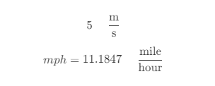
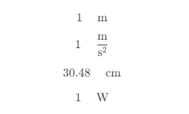
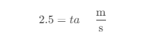
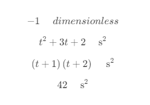
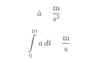
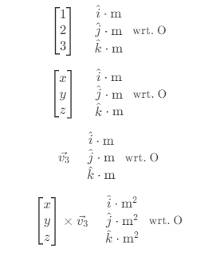
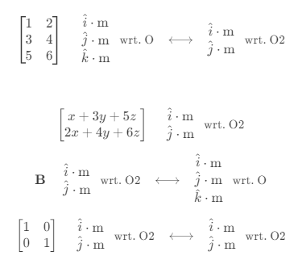

# mathpad

<!-- TODO: set up all the services needed for these badges -->
<!-- <p align="center">
  <a href="https://github.com/CallumJHays/mathpad/actions?query=workflow%3ACI">
    
  </a>
  <a href="https://mathpad.readthedocs.io">
    
  </a>
  <a href="https://codecov.io/gh/CallumJHays/mathpad">
    
  </a>
</p>
<p align="center">
  <a href="https://python-poetry.org/">
    
  </a>
  <a href="https://github.com/ambv/black">
    
  </a>
  <a href="https://github.com/pre-commit/pre-commit">
    
  </a>
</p>
<p align="center">
  <a href="https://pypi.org/project/mathpad/">
    
  </a>
  
  
</p> -->

`mathpad` is a robust Computer Algebra System (CAS) library built on top of `SymPy`, providing a simple and intuitive way to solve engineering, science, and math problems using Python.

## Quickstart
1. Install using package manager of choice. For example, `pip`:

```bash
pip install mathpad
```

2. Import and use the library in `python`:

  <table style="width: 100%;">
  <tr>
  <td> Code </td> <td> Display </td>
  </tr>
  <tr>
  <td>

  ```python
  from mathpad import *

  v = 5 * m / s

  mph = "mph" * miles / hour
  eqn = mph == v.eval()
  ```

  </td>
  <td>

  

  </td>
  </tr>
  </table>


## Documentation

Currently the only in-depth documentation is `Walkthrough.ipynb`. You can access it on the [JupyterLite Sandbox Site here](https://callumjhays.github.io/mathpad/lab?path=Walkthrough.ipynb). 


## Showcase

<table style="width: 100%;">
<col style="width: 10%" />
<col style="width: 45%" />
<col style="width: 45%" />

<tr>
<td>Feature</td> <td>Example</td> <td> Display </td>
</tr>
<tr>
<td>Units</td>
<td>

```python
m

m / s ** 2

feet.in_units(cm)

(V * A).in_units(watt)
```

</td>
<td>



</td>
</tr>
<tr>
<td>Values</td>
<td>

```python
v = 2.5 * m / s

c = m(5)
```

</td>
<td>


</td>
</tr>
<tr>
<td>Symbols</td>
<td>

```python
t = "t" * seconds

y = "\\hat{y}_1" * volts
```

</td>
<td>


</td>
</tr>
<tr>
<td>Symbolic Functions</td>
<td>

```python
a = "a(t)" * m / s ** 2
```

</td>
<td>


</td>
</tr>
<tr>
<td>Equations</td>
<td>

```python
eqn = (v == a * t)
```

</td>
<td>



</td>
</tr>
<tr>
<td>Solving</td>
<td>

```python
sln, = solve([eqn], solve_for=[a])

sln[a]
```

</td>
<td>


</td>
</tr>
<tr>
<td>Algebra</td>
<td>

```python

simplify(e ** (1j * pi))

expand((t + 1)(t + 2))

factor(t**2 + 3 * t * s + 2)

subs((t + 1)(t + 2), { t: 5 })
```

</td>
<td>



</td>
</tr>
<tr>
<td>Calculus</td>
<td>

```python
diff(a, wrt=t, order=1)


integral(a, wrt=t, between=(0, 10))
```

</td>
<td>



</td>
</tr>
<tr>
<td>Vectors</td>
<td>

```python
O = R3("O") # 3D frame of reference
v1 = O[1, 2, 3]


x, y, z = ("x", "y", "z") * m
v2 = O[x, y, z]


v3 = "v_3" @ O


v2.cross(v3)
```

</td>
<td>



</td>
</tr>
<tr>
<td>Matrices</td>
<td>

```python
O2 = R2("O2")
A = Mat[O, O2](
    [1, 2],
    [3, 4],
    [5, 6]
)


v2_wrt_O2 = v2 @ A


B = Mat[O2, O]("B")


I = Mat[O2, O2].I
```

</td>
<td>



</td>
</tr>
<tr>
<td>Numpy Compatibility</td>
<td>

```python
y = sin(t)
y_fn = as_numpy_func(y)

y_fn({ t: [1, 2, 3] })

import numpy as np
y_fn({
  t: np.arange(
    start=0, stop=2 * np.pi, step=np.pi / 12
  )
})
```

</td>
<td style="font-family: Consolas;">
<br />

array([0.84147098, 0.90929743, 0.14112001])
<br />
<br />
<br />

array([0.        , 0.25881905, 0.5       , 0.70710678, 0.8660254 ,
       0.96592583, 1.        , 0.96592583, 0.8660254 , 0.70710678,
       0.5       , 0.25881905])

</td>
</tr>
<tr>
</td>
</tr>
<tr>
<td>Code Generation</td>
<td>

```python

generate_c_code(theta, [t])
```

</td>
<td>


</td>
</tr>


</table>


<!-- ## Contributors ✨

Thanks goes to these wonderful people ([emoji key](https://allcontributors.org/docs/en/emoji-key)): -->

<!-- ALL-CONTRIBUTORS-LIST:START - Do not remove or modify this section -->
<!-- prettier-ignore-start -->
<!-- markdownlint-disable -->
<!-- markdownlint-enable -->
<!-- prettier-ignore-end -->

<!-- ALL-CONTRIBUTORS-LIST:END -->

<!-- This project follows the [all-contributors](https://github.com/all-contributors/all-contributors) specification. Contributions of any kind welcome! -->

## Credits

This package was created with
[Cookiecutter](https://github.com/audreyr/cookiecutter) and the
[browniebroke/cookiecutter-pypackage](https://github.com/browniebroke/cookiecutter-pypackage)
project template.
